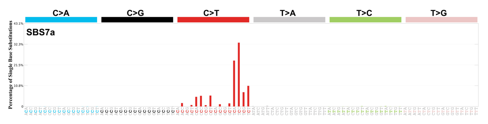
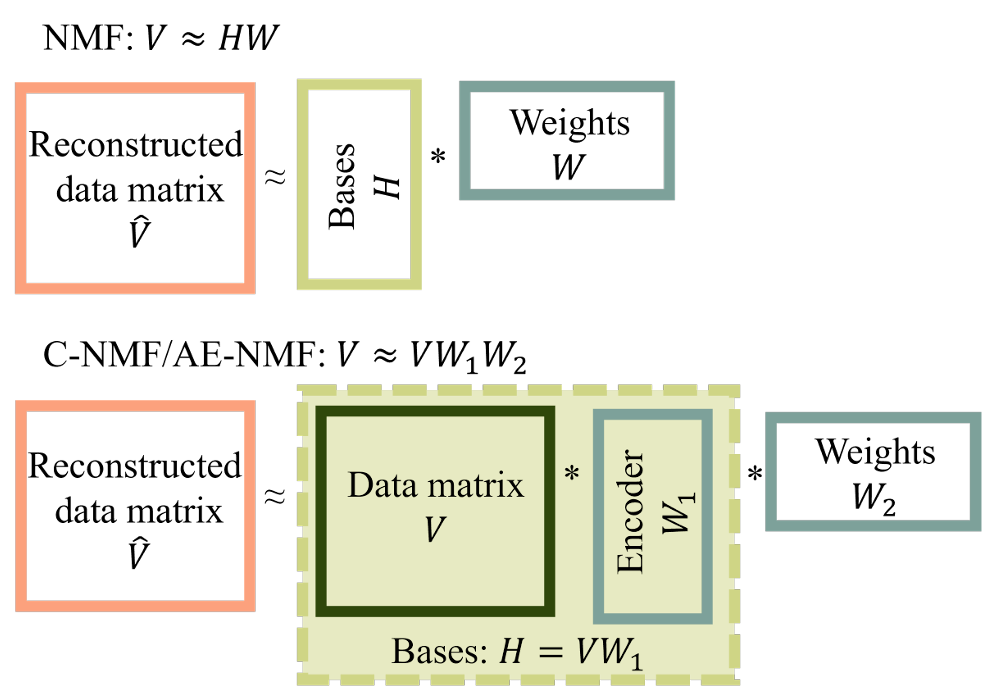

# Autoencoders for mutational signatures extraction

## Introduction 
Mutational signatures are distinct patterns of mutations that result from specific biological processes or external environmental factors.

When we refer to mutations, we mean changes in the DNA sequence of an allele, one of the two copies of a gene that we inherit from our parents.

When analyzing mutations in normal tissue, we compare them to the reference genome, which represents the most common sequence of the human genome. Mutations can be classified into two main categories:

- **Germline mutations**: Inherited from our parents and present in every cell of the body.
- **Somatic mutations**: Acquired during a person's lifetime and not inherited.
Since cancer is driven by the accumulation of mutations, identifying common patterns across different patients is crucial for understanding tumor development.

In mutational signature analysis, we specifically focus on somatic mutations, which arise during a patient’s lifetime rather than being inherited. These mutations can be caused by different factors, including environmental exposures, defective DNA repair mechanisms or endogenous (internal) processes.

Mutational processes can be broadly classified into two categories:
- **Endogenous mutational processes** (e.g. DNA replication errors, defective DNA repair mechanisms)
- **Exogenous mutational processes** (e.g. exposure to ultraviolet light, tobacco smoke)

Understanding mutational signatures is particularly useful for devising personalized patient treatment, as different mutations are linked to specific causes of tumorigenesis. 
### Mutational contexts
In this project we'll focus on the analysis of single base substitutions (SBS), which involve the mutation of a single nucleotide in the DNA sequence within a specific context. The context refers to the bases immediately before and after the mutated base. 

If two consecutive bases are mutated, we refer to them as double base substitutions (DBSs). Other types of mutations, such as insertions and deletions (indels), exist but will not be considered in this project.

Single base substitutions can be classified into six types, depending on the type of base substitution:
- C>A (cytosine to adenine)
- C>G (cytosine to guanine)
- C>T (cytosine to thymine)
- T>A (thymine to adenine)
- T>C (thymine to cytosine)
- T>G (thymine to guanine)

The context of a mutation is crucial, as the surrounding bases can influence the likelihood of a mutation occurring. 
This results in 96 possible combinations (6 types of base substitutions $\times$ 4 possible bases before $\times$ 4 possible bases after the mutated base).
Thus, an SBS mutation is classified based on its specific trinucleotide context.

If we define a probability vector $p_i$, where each element represents the probability of observing mutation type $i$ in a given signature. The
matrix $W$ contains these probabilities for each mutational signature, ensuring that the sum of the elements in each column is equal to 1.

The following image shows an example of a mutational signature associated with U-V light mutational processes.

A catalog of known mutational sginatures can be found in the [COSMIC database](https://cancer.sanger.ac.uk/signatures), which is used as a reference for comparing and identifying new signatures.
## Project overview TODO:check this part
Signatures can be represented as a matrix factorization problem, where the data matrix, consisting of non-negative counts of mutations in each trinucleotide context, is factorized into two non-negative matrices: the signature matrix and the exposure matrix. 
Throught this project we want to extract these two lower rank matrices, with a special focus on autoencoders.

TODO: fix this part when we have decided on dataset/data augmetation/synthetic data

The data we used is....

Firstly, as a benchmark, we used NMF and convex-NMF to extract the signature and exposure  matrices, these are the most common methods used for this task. 
Then, we explored the use of autoencoders, starting with a shallow autoencoder with non-negativity constraints.
Since the activation function is identity, this autoencoder is equivalent to PCA.
We also imìnvestigated the use of a shallow denoising sparse autoencoder,with non-negativity constraints to ensure the extracted weigths were coherent with the problem at hand. This model should be more robust to noise and overfitting, and provide a more sparse representation of the data.

#TODO : check this part, fix it when decided what to do
Finally, we implemented a more complex autoencoder, MUSE-XAE, which incorporates bootstrapping, Poisson likelihood in the loss function, early stopping, and k-means to extract the best decoder weights. 
The results should provide insights into the performance of autoencoders compared to the classical NMF methods, and potentially identify non-linear relationships between the data that are not captured by NMF.
## Data (M)
- Description of the data
  - GEL / Qualcosa di diverso
  - Dati sintetici (?), sicuramente in fase di sviluppo
- Data preprocessing: data loading, augmentation (?), normalization

## [NMF](references/AENMF.pdf) (A)
In this first section we will provide a foundation to understand the relationship between non-negative matrix factorization (NMF) and non-negative autoencoders enabling proper interpretation and understanding of autoencoder-based alternatives to NMF. Since its introduction, NMF has been a popular tool for extracting interpretable, low-dimensional representations of high-dimensional data. However, recently, several studies have proposed to replace NMF with autoencoders.We find that the connection between the two models can be established through convex NMF, which is a restricted case of NMF. In particular, convex NMF is a special case of an autoencoder. The performance of NMF and autoencoders is compared within the context of extraction of mutational signatures from cancer genomics data.

- What is NMF? $\checkmark$
- How is NMF used in the mutational signature context (extraction of Signature & Exposure matrix and their meaning)
- Mathematical formulation $\checkmark$
- c-nmf (particular case of NMF) $\checkmark$

**Non-negative matrix factorization** (NMF) is a tool for unsupervised learning that factorizes a non-negative data matrix into a product of two non-negative matrices of lower dimension: a basis matrix consisting of basis vectors and a weight matrix consisting of the basis vector’s weights for each observation in the data matrix.

Suppose we have a non-negative matrix $V$ of size $M \times N$, where $M$ is the number of features and $N$ is the number of samples. NMF decoposes $V$ into two non-negative matrices: 
- the basis matrix $H\in \mathbb{R}^{M \times K}_+$ 
- the weight matrix  $W\in \mathbb{R}^{K \times N}_+$ 

The shared dimension, $K$ , of the factor matrices, is typically chosen to be much smaller than the dimensions of the input matrix, making NMF a dimensionality reduction technique.

Standard $K$-dimensional NMF aims to make a reconstruction $\hat{V}$ of the original data matrix by a product of two non-negative matrices: 

$$\hat{V}=HW$$

where each column in $H$ represents a basis vector and each column in $W$ represents each sample’s weights when being reconstructed as a linear mixture of the basis vectors.

**Convex NMF** is a special case of NMF, where the basis vectors are constrained to be spanned by the columns of the data matrix $V$, thus the data matrix is approximated by:

$$\hat{V} = V W_1 W_2$$

with $W_1, W^T_2 \in \mathbb{R}^{N \times K}_+$. We can obtain the NMF formulation by simply defining $H = V W_1$ and $W = W_2$.

## [What are AE and their relationship with c-NMF](references/AENMF.pdf) (A)
**Autoencoders** are a type of neural network used to learn efficient codings of input data. They work by compressing the input into a *latent-space* representation through the *encoder* and then reconstructing the output from this representation through the *decoder*. Choosing the dimension of the latent representation to be lower than the dimension of the input makes the autoencoder a dimensionality reduction technique. A single hidden layer and fully connected autoencoder’s reconstruction, $\hat{V}$ , of a data matrix, $V$ , is mathematically defined as:

$$\hat{V} = \phi_{dec}(\phi_{dec}(VW_{enc} + b_{enc})W_{dec} + b_{dec})$$

where $W_{enc}, W_{dec}^T \in \mathbb{R}^{N \times K}$ are the encoding matrices, $b_{enc} \in \mathbb{R}^K$ and $b_{dec} \in \mathbb{R}^N$ are the bias terms of the encoding and the decoding layers and $\phi_{enc}: \mathbb{R}^{M \times K} \rightarrow \mathbb{R}^{M \times K}$ $\phi_{dec}: \mathbb{R}^{M \times N} \rightarrow \mathbb{R}^{M \times N}$ are the activation functions which provide entry-wise modifications of the affected nodes, those functions are responsible for the non-linearity into the neural network.

**relationship with c-NMF:**
By setting $b_{enc}=0_K, b_{dec}=0_N$, and $\phi_{enc}, \phi_{dec}:x \rightarrow x$ while constraining the weights to be non-negative we obtain the convex NMF, where $W_1$ corresponds to the encoding matrix and $W_2$ corresponds to the decoding matrix. Thus, non-negative autoencoders can be constructed to be mathematically equivalent to convex NMF. 
The equivalence between C-NMF and AE-NMF is the link that enables one to interpret the parameters in AE-NMF similarly to NMF, therefore this orientation is crucial for proper comparison.
Though the interpretation of AE-NMF, C-NMF, and NMF is similar, there are still considerable differences between C-NMF, AE-NMF, and standard NMF. In particular, NMF estimates $N · K + K · M$ parameters whereas AE-NMF and C-NMF estimates $2 · (K · N)$ parameters. Thus, AE-NMF and C- NMF will estimate a larger number of parameters in the factor matrices than NMF when the number of observations $N$ surpasses the number of features $M$, which is often the case within mutational signatures.

## [Relationship between AE-NMF and PCA](references/AENMF.pdf) (A)

### Brief recap on PCA 
**Principal Component Analysis** (PCA) is a technique used for **dimensionality reduction** that identifies a set of orthogonal axes, called principal components, that capture the maximum variance in the data. 
Dimensionality reduction is useful when we work with high dimensional data that we think has dimensions that are highly correlated and therefore we think the data lives in a lower dimension structure (a manifold). Reducing the dimension allows to reduce the impact of the curse of dimensionality and to better understand what’s important in our data.

The idea behind PCA is that some dimensions, called principal components, explain more of the data variance than others. 
The principal components are linear combinations of the original variables in the dataset and are ordered in decreasing order of importance. The total variance captured by all the principal components is equal to the total variance in the original dataset. The first principal component captures the most variation in the data, but the second principal component captures the maximum variance that is orthogonal to the first principal component, and so on.

By reducing the dimensionality of the data down to its principal components we guarantee that they’re uncorrelated and we hope to lose little variance information while gaining a more tractable data space.

The process behind PCA involves the following steps:

1. Standardize the data $Z= \frac{X - \mu}{\sigma}$
2. Compute the covariance matrix $C$
3. Compute the eigenvalues and eigenvectors of $C$
4. Sort the eigenvalues in descending order

The higher the eigenvalue the more important that dimension is in explaining the variance.

### Mathematical relationship between PCA and AE-NMF
The relationship between Principal Component Analysis (PCA) and a shallow autoencoder is rooted in their shared goal of dimensionality reduction and feature extraction. Both methods aim to represent data in a lower-dimensional space while preserving as much information as possible. However, they achieve this through different mechanisms and assumptions.

Both PCA and shallow autoencoders reduce the number of dimensions in the data while retaining its most important features. PCA achieves this by projecting data onto a linear subspace, while an autoencoder learns a compressed representation (latent space).

Both methods aim to reconstruct the original data from the reduced representation. In PCA, reconstruction is performed using the principal components. In an autoencoder, reconstruction is handled by the decoder.

A shallow autoencoder with a single hidden layer, linear activation functions, and mean squared error (MSE) as the loss function is mathematically equivalent to PCA. In this special case, the autoencoder's hidden layer learns the same linear subspace as PCA's principal components. Let's see the mathematical [proof](https://arxiv.org/pdf/1804.10253):

Consider only one hidden layer and that the layers in the network are fully connected. A vector $y_i \in \mathbb{R}^{n \times 1}$ passes through the hidden layer, which outputs $x_i \in \mathbb{R}^{m \times 1}$ according to the mapping 

$$x_i = a (W_1 y_1 + b_1)$$

where $W_1 \in \mathbb{R}^{m \times n}$ is referred to as the weight matrix of the first layer, $b_1 \in \mathbb{R}^{m \times 1}$ is referred to as the bias vector of the first layer, and $m < n$. The function $a$, referred to as the activation function, operates element-wise and is typically a non-linear function such as the rectified linear unit (ReLU). The second layer maps $x_i$ to $\hat{y}_i \in \mathbb{R}^{n \times 1}$ according to 

$$\hat{y}_i = a(W_2 x_i + b_2) = a(W_2 a(W_1 y_i + b_1)+ b_2)$$

where $W_2 \in \mathbb{R}^{n \times m}$ and $b_2 \in \mathbb{R}^{n \times 1}$ are the weight matrix and bias vector of the second layer. The parameters $W_1, b_1, W_2, b_2$ are found by minimizing le reconstruction loss function measuring the difference between the output $\hat{y}_i$ and the input $y_i$. 

In the case that no non-linear activation function is used

$$x_i = W_1 y_i + b_1, \hat{y}_i = W_2 x_i + b_2$$

then we obtain 

$$\min_{W_1, b_1, W_2, b_2} \|\| Y - (W_2(W_1Y + b_1 \mathbb{1}^T_N) + b_2 \mathbb{1}^T_N) \|\|^2_F$$

where $F$ denotes the Frobenius norm. If we set the partial derivative with respect to $b_2$ to zero, the problem becomes:

$$\min_{W_1, W_2} \|\| Y_0 - W_2 W_1 Y_0\|\|^2_F$$

Thus, for any $b_1$, the optimal $b_2$ is such that the problem becomes independent of $b_1$ and of $\bar{y}$. Therefore, we may focus only on the weights $W_1, W_2$. When setting the gradients to zero, $W_1$ is the left Moore-Penrose pseudoinverse of $W_2$ (and $W_2$ is the right pseudoinverse of $W_1$): $W_1 = W^*_2 = (W^T_2 W_2)^{-1} W^T_2$. Thus, the minimization remains with respect to a single matrix:

$$\min_{W_2 \in \mathbb{R}^{n \times m}} \|\| Y_0 - W_2 W^*_2 Y_0\|\|^2_F \ \ \ \ \ \ \ \ (\Diamond)$$

The matrix $W_2 W^*_2 = W_2 (W^T_2 W_2)^{-1} W^T_2$ is the orthogonal projection operator onto the column space of $W_2$ when its columns are not necessarily orthonormal.This formulation can be minimized by $W_2$ if and only if its column space is spanned by the first $m$ loading vectors of $Y$.

Now consider PCA,the first $m$ principal component $P_m$ are a solution to

$$\min_{W \in \mathbb{R}^{n \times m}} \|\| Y_0 - W W^T Y_0\|\|^2_F \ \ s.t. \ \ W^T W = I_{m \times m} \ \ \ \ \ \ \ \ (\triangle)$$

According to this formulation, the $m$ leading loading vectors are an orthonormal basis which spans the $m$ dimensional subspace onto which the projections of the centered observations have the minimum squared difference from the original centered observations. In other words, $P_m$ compresses each centered vector of length n into a vector of length $m$ (where $m \leq n$) in such a way that minimizes the sum of total squared reconstruction errors.
Yet, the minimizer of this formula is not unique: $W = P_m Q$ is also a solution, where $Q \in \mathbb{R}^{m \times m}$ is any orthogonal matrix, $Q^T = Q^{−1}$. Multiplying $P_m$ from the right by $Q$ transforms the first $m$ loading vectors into a different orthonormal basis for the same subspace.

As we can see from this formulations, $(\Diamond)$ and $(\triangle)$ are really similar, by applying the QR decomposition to $W_2$ in $(\Diamond)$, it's possible to transform $(\Diamond)$ in $(\triangle)$. As a result, it's possible to solve $(\triangle)$ by first solving the unconstrained problem $(\Diamond)$, and then orthonormalizing the columns of the solution, e.g. using the Gram-Schmidt process. However, this does not recover the loading vectors $P_m$, but rather $P_m Q$ for some unknown orthogonal matrix $Q$.

The linear autoencoder is said to apply PCA to the input data in the sense that its output is a projection of the data onto the low dimensional principal subspace. However, unlike actual PCA, the coordinates of the output of the bottleneck are correlated and are not sorted in descending order of variance. In addition, the solutions for reduction to different dimensions are not nested: when reducing the data from dimension $n$ to dimension $m_1$, the first $m_2$ vectors ($m_2 < m_1$) are not an optimal solution to reduction from dimension $n$ to $m_2$, which therefore requires training an entirely new autoencoder.

## [Denoising Sparse Autoencoder](references/Denoising.pdf) (M)
- TODO: Add a bit more mathematical notation, after we decide what to use, to avoid inconsistencies

Denoising sparse autoencoders are a combination of two techniques: denoising autoencoders and sparse autoencoders.
### Denoising autoencoders
Denoising autoencoders are trained to reconstruct the original input from a corrupted version of it. This is done by adding noise to the input data and training the model to recover the original data. The idea behind this technique is to make the autoencoder more robust to noise and improve its generalization capabilities.
In our case, we decided to add random Gaussian noise to the input count matrices before the training procedure.
### Sparse autoencoder
Sparse autoencoders are designed to learn a sparse representation of the input data. This means the model is encouraged to use only a small number of neurons in the hidden layer, leading to a more compact and efficient representation. This helps reduce overfitting and enhances generalization.
To enforce sparsity, we incorporated L1 regularization in the loss function, which penalizes large activations in the hidden layer.

TODO: add what we did in the project

## [MUSE-XAE](references/MUSE-XAE.pdf) (N)

### Bootstrapping (data aug)
### Poissong Likelihood in loss + early stopping 
### while the third term represents the logarithm of the minimum volume constraint (??) (vediamo se metterlo) $$\beta$$
### K-means to extract best decoder weights -> Consensus matrices
### Signature assignment
### De novo extraction scenario on synt data (1)
### De novo extraction on real data (GEL/WGS)
### Analysis of how data aug improves results on various metrics
### (Confronto generale con i nostri AEs ed NMF)
### T-sne (depending on what we use for dataset)

## Denoising Sparse Muse-XAE (maybe) (N)

## Results (N + M + A)

## Conclusion (N + M + A)

## Authors

- [Nicola Cortinovis](https://github.com/NicolaCortinovis)
- [Marta Lucas](https://github.com/15Max)
- [Annalisa Paladino](https://github.com/annalisapaladino)

Checkout our brief [presentation](https://docs.google.com/presentation/d/1hB-mI9om3PHqgEYXrScLB-Zd6lbMrCy3XqS4fKMXX7o/edit?usp=sharing) for a quick overview of the project.
 #TODO : add a link with visualization permits only
## References (N + M + A)
- On the Relation Between Autoencoders and Non-negative Matrix
Factorization, and Their Application for Mutational Signature
Extraction ; Egendal et al. (2024)
- Decoding whole-genome mutational signatures in 37 human
pan-cancers by denoising sparse autoencoder neural network; Pei et al. (2020)
- MUSE-XAE: MUtational Signature Extraction with
eXplainable AutoEncoder enhances tumour types
classification; Pancotti et al. (2024)

  
